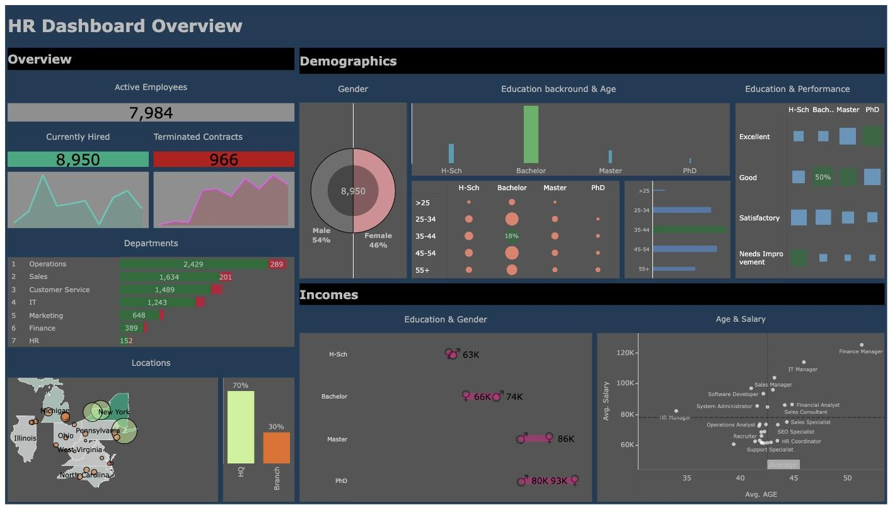

# HR Analytics Dashboard (Tableau)

An interactive Tableau dashboard that gives HR managers a one-page overview of a company's workforce: headcount, hiring and turnover, employee demographics and how salaries vary with education, gender and age.

## Dashboard

**[View the interactive dashboard on Tableau Public →](https://public.tableau.com/app/profile/abir.hossain4647/viz/HRdashboard_17405980352850/HRSUMMARY)**

The dashboard has three sections:
- **Overview:** active employees, total hired and terminated contracts with trends over time, headcount by department, and where employees are located (map plus the headquarters/branch split)
- **Demographics:** gender split, education level by age group, and performance rating by education level
- **Incomes:** average salary by education and gender, and average salary against average age for each job title

## Key findings
- **8,950 people hired, 966 contracts terminated, 7,984 currently active.**
- **Operations is by far the largest department** (2,429 employees), followed by Sales and Customer Service. HR is the smallest.
- **70% of staff work at headquarters** and 30% at branch offices.
- **The workforce is 54% male and 46% female**, and most employees hold a bachelor's degree.
- **Salary rises with education:** about 63K on average with a high school education, 66–74K with a bachelor's degree, about 86K with a master's and 80–93K with a PhD.
- **Managers earn the most:** Finance Manager has the highest average salary, while support roles are at the bottom of the range.

## Data
`HumanResources.csv` contains 8,950 employee records with ID, name, gender, state and city, education level, birth date, hire date, termination date, department, job title, salary and performance rating.

## What I did
- Derived age and age groups from birth dates, and active/terminated status from termination dates
- Built calculated fields for headcount, hires and terminations over time
- Designed each chart to answer one question and arranged them in an overview → demographics → incomes layout

## Files
| File | Description |
|---|---|
| `HumanResources.csv` | The dataset |
| `link to the project` | Link to the dashboard on Tableau Public |
| `images/` | Dashboard screenshot |

## Tools
Tableau
